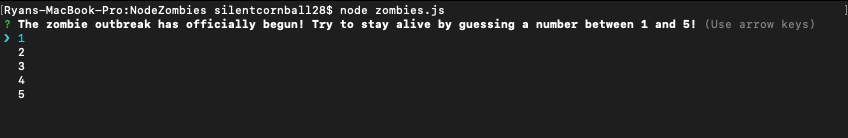
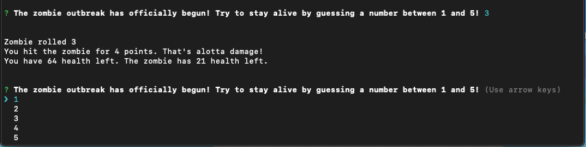
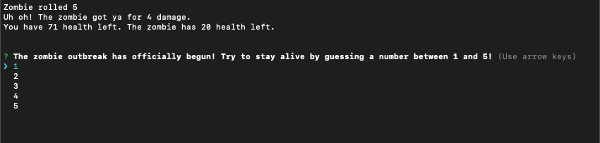
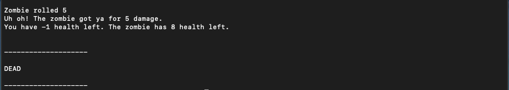
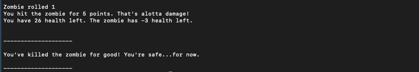

# NodeZombies
## Overview
This is a number guessing game that can be run on the terminal through Node.js.

## Technologies
- Node.js
- Javascript
- Inquirer.js

## Demo
When in the local file, just type "node zombies.js" to start the game. Here, the player will choose a number between 1 and 5. The game will randomly choose a number between 1 and 5 as well as the zombie's "damage." The player starts with 75 health points and the zombie starts at 25 health points.

If the player guesses the same number the as the zombie's damage, the zombie looses health based on another randomly choosen number between 1 and 5.

If the player guesses a different number from the zombie's damage, they loose health based on the second randomly choosen number.

If the player's health is brought at or below zero, they lose the game.

If the zombie's health is brought at or below zero, the player wins the game.

